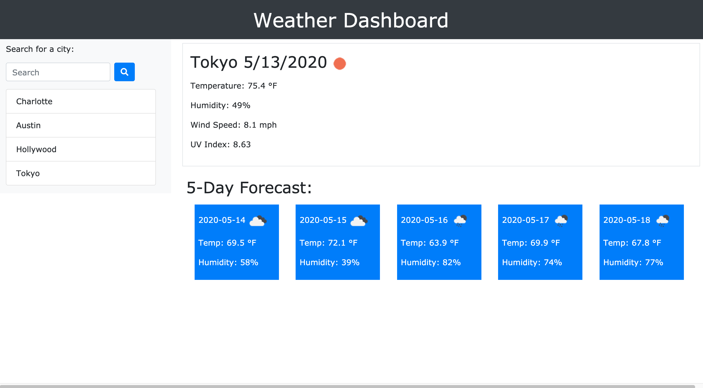

# weather-dashboard
UNCC Coding Boot Camp - Homework 06

## Assignment
* This assignment was to build a weather dashboard that runs in the browser. It features dynamically updated HTML and CSS and uses the OpenWeather API for weather and city data.

## URLs
* GitHub Repository: https://github.com/egrenegar/weather-dashboard
* Deployed Application: https://egrenegar.github.io/weather-dashboard/

## Deployed Application

